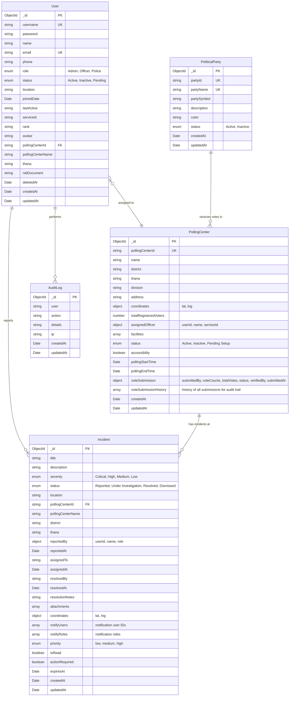

# AmarVote Database ERD

## Entity Relationship Diagram



---

## Relationships

| From | To | Type | Description |
|------|-----|------|-------------|
| User | Incident | One-to-Many | Officers/Police report incidents (with notification) |
| User | AuditLog | One-to-Many | Users perform logged actions |
| User | PollingCenter | Many-to-One | Officers assigned to polling centers |
| PollingCenter | Incident | One-to-Many | Centers can have multiple incidents |
| PoliticalParty | PollingCenter | One-to-Many | Parties receive votes (embedded in voteSubmission) |

---

## Collections Overview (5 Total)

### 🔐 1. Users
**Purpose:** Manage all system users (Admin, Officer, Police)

**Key Features:**
- 3 roles: Admin, Officer, Police
- 3 statuses: Active, Inactive, Pending
- Unique: username, email
- Password hashing with bcrypt
- Polling center assignment for Officers

### ⚠️ 2. Incidents (includes Notifications)
**Purpose:** Track election irregularities and send notifications

**Key Features:**
- 4 severity levels: Critical, High, Medium, Low
- Status workflow: Reported → In Progress → Resolved
- GPS coordinates for location
- Assignment to users for resolution
- **Notification fields:** notifyUsers, notifyRoles, priority, isRead, actionRequired
- Attachment support for evidence

### 📍 3. PollingCenters (includes Vote Submissions)
**Purpose:** Polling stations with embedded vote submission data

**Key Features:**
- Unique polling center ID
- Location: Division → District → Thana hierarchy
- GPS coordinates
- Registered voters count
- Officer assignment tracking
- Facilities array
- **Embedded voteSubmission object:**
  - submittedBy (userId, name, serviceId)
  - voteCounts array (partyName, partySymbol, votes)
  - totalVotes
  - status: Submitted, Verified, Rejected, Correction Requested
  - verifiedBy, verifiedAt
  - rejectionReason, correctionNotes

### 🎯 4. PoliticalParties
**Purpose:** Master data for political parties

**Key Features:**
- 7 seeded parties (Party A-F + Independent)
- Party symbols and colors
- Active/Inactive status management
- Used for vote counting

### 📝 5. AuditLogs
**Purpose:** Immutable activity tracking

**Key Features:**
- Tracks all system actions
- User, action, timestamp, IP address
- Cannot be modified (compliance)
- Indexed for time-based queries

---

## Database Statistics

```
Collections: 5 (consolidated from 8)
Users: 2 (1 Admin, 1 Officer)
Polling Centers: 3 (with embedded vote submission capability)
Political Parties: 7
Incidents: Sample data with notification fields
Audit Logs: System initialization log
```

---

## Data Consolidation

**Merged Collections:**
1. ✅ **Notifications → Incidents** (notifyUsers, notifyRoles, priority, isRead, actionRequired, expiresAt)
2. ✅ **VoteSubmissions → PollingCenters** (voteSubmission object with all submission data)
3. ✅ **SystemSettings** (removed - no longer needed)

**Benefits:**
- Simplified database structure
- Fewer API endpoints to maintain
- Reduced data duplication
- Better performance (fewer joins)
- All data stored in database (no hardcoded values)

---

## Connection Info

**Database:** MongoDB Atlas Cloud  
**Cluster:** amarvote-db.sgvyt9r.mongodb.net  
**Database Name:** amarvote  
**Environment:** .env.local

---

## Next Steps

✅ Database consolidated to 5 collections  
✅ All models updated with merged fields  
✅ API routes streamlined  
✅ Seed data updated  

**Test the changes:**
1. Run: `npm run seed` to reseed the database
2. Login with: `admin` / `admin123`
3. Test incident creation (now includes notification fields)
4. Test vote submission (now embedded in polling centers)
